# Signal Processing Projects

This repository contains various signal processing projects implemented using Python. The projects range from basic signal manipulation to more complex tasks such as signal filtering and recovery. Below is a brief description of each project along with corresponding screenshots.

## Project Descriptions

### 1. Continuous and Discrete-Time Signals
- **1_1.py**: Implements and plots the continuous-time signal `x(t) = u(t+1) + u(t-2) + u(t-4)` using the unit step function.
  - 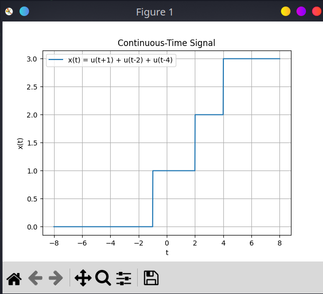
- **1_2.py**: Similar to 1_1.py with a different implementation of the unit step function.
  - 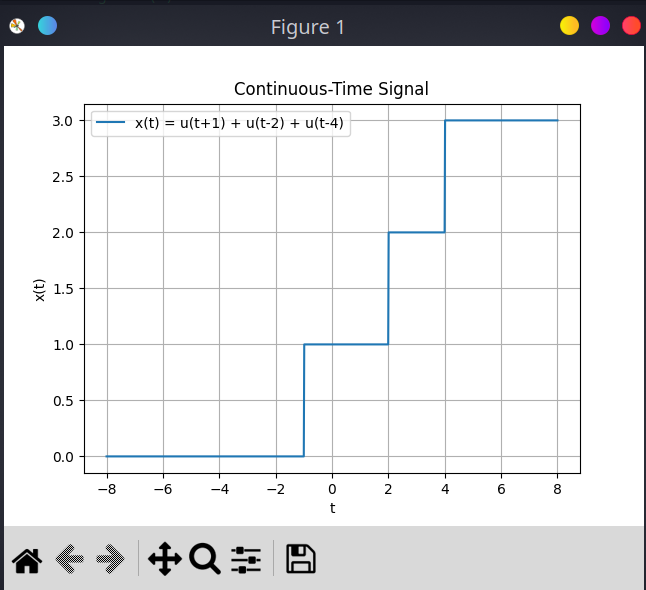
- **1_3.py**: Plots a discrete-time ramp signal.
  - 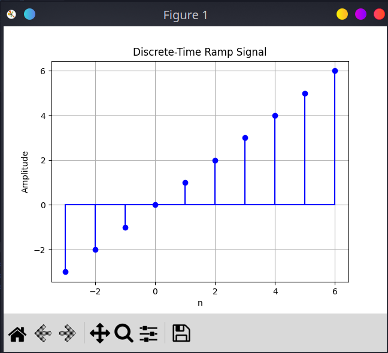
- **1_4.py**: Plots the real part, imaginary part, magnitude, and phase of a complex sequence `x[n] = r^n * exp(j*w*n)`.
  - 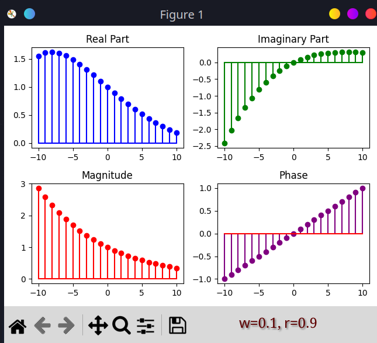

### 2. Convolution of Signals
- **2_1.py**: Convolves two discrete-time square pulse signals.
  - 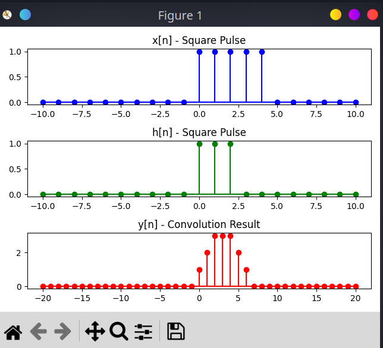
- **2_2.py**: Convolves two continuous-time square pulse signals.
  - 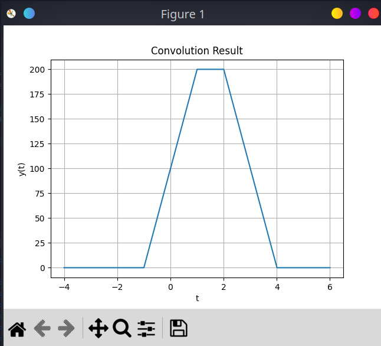
- **2_3.py**: Convolves a decaying exponential signal and a piecewise linear function.
  - 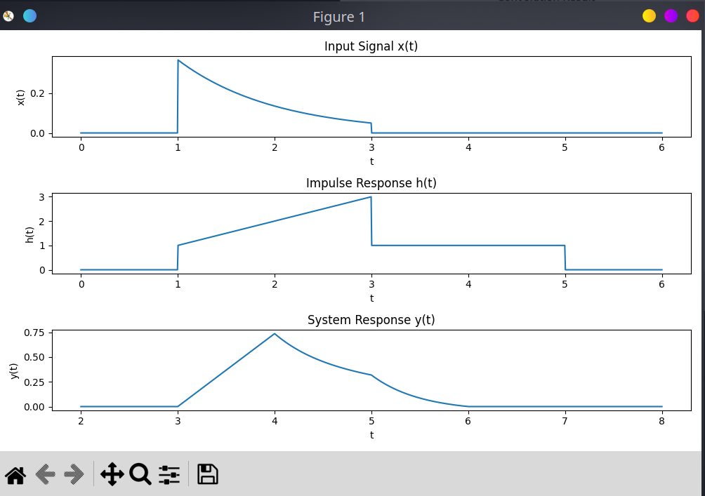

### 3. Fourier Series Approximation
- **3.py**: Generates a square wave and its Fourier series approximation using odd harmonics.
  - 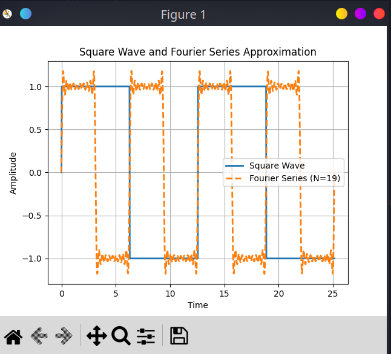

### 4. Signal Analysis and Recovery
- **4_1_1.py**: Adds white Gaussian noise (AWGN) to a continuous-time cosine signal and plots the result.
  - 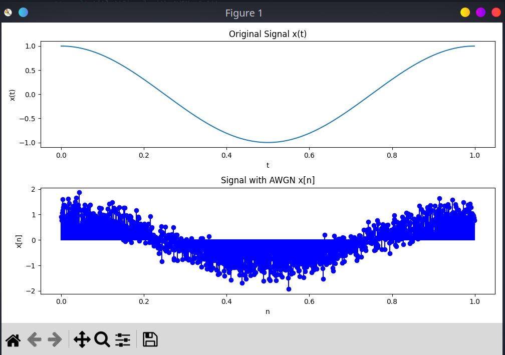
- **4_1_2.py**: Applies a Butterworth low-pass filter to a noisy signal to recover the original signal.
  - 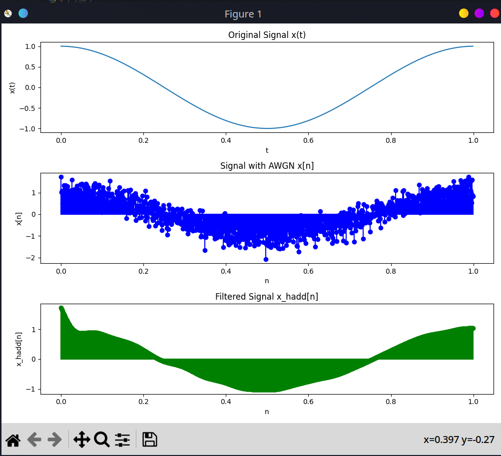
- **4_2_1.py**: Plots the waveforms of an original and distorted audio signal.
  - 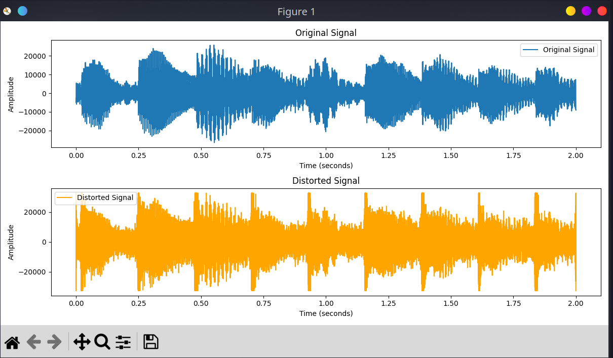
- **4_2_2.py**: Computes the Mean Squared Error (MSE) between the original and distorted signals.
- **4_2_3.py**: Applies a low-pass filter to a distorted audio signal to attempt recovery.
- **4_2_4.py**: Calculates the MSE between the original and recovered audio signals.

## Requirements

The required Python packages for running the projects are listed in `requirements.txt`. You can install them using the following command:

```bash
pip install -r requirements.txt
```

## Usage
Each script can be run individually to observe the respective signal processing task. Ensure that the required dependencies are installed and that any input files (such as audio files) are available in the project directory.

To run a specific script, use the following command:
```bash
cd src/

python <script_name>.py
```